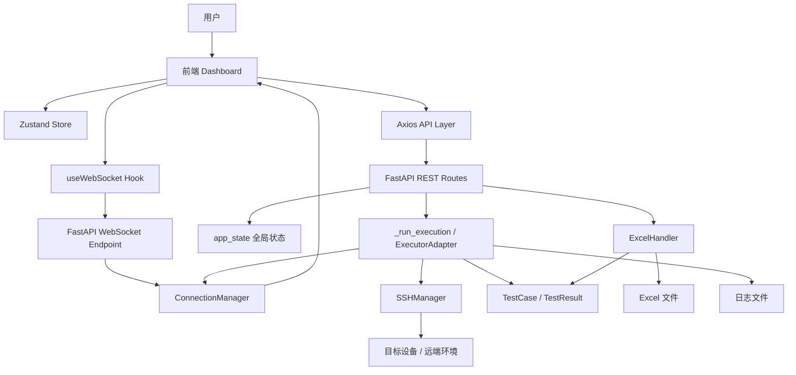
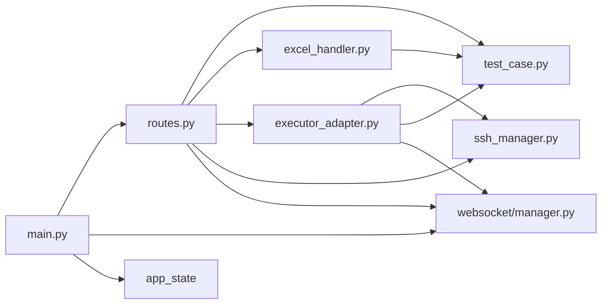
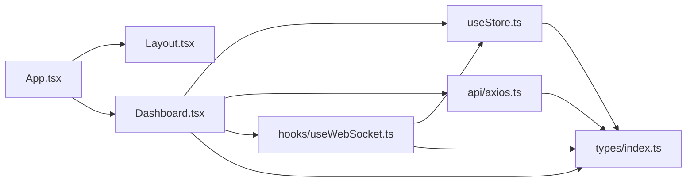
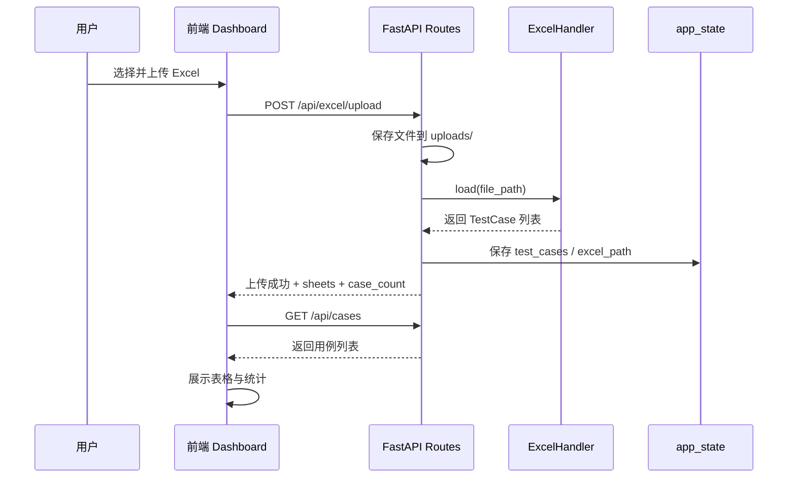
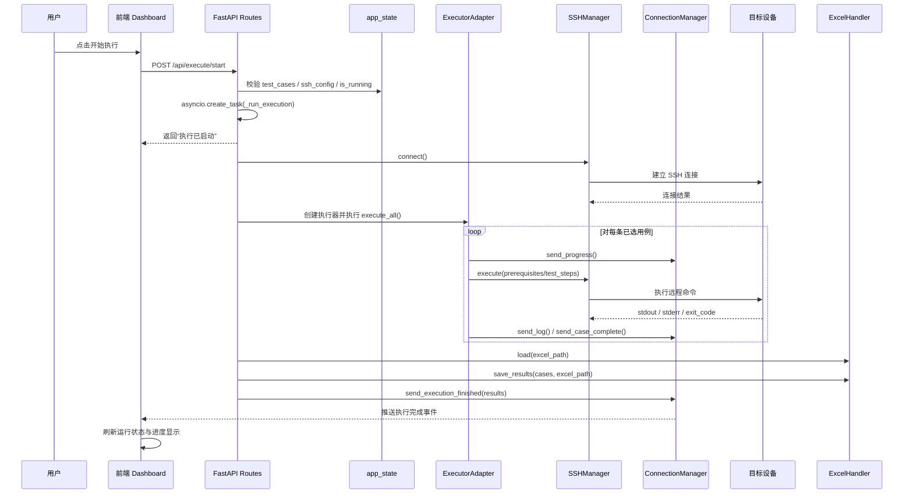
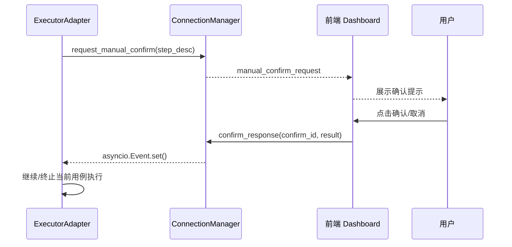

# 测试执行管理系统架构说明

## 0. 文档控制信息

| 项目 | 内容 |
|---|---|
| 文档名称 | 测试执行管理系统架构说明 |
| 适用工程 | `test_runner_web` |
| 文档类型 | 软件架构说明书（Architecture Description） |
| 当前状态 | Draft / 内部评审版 |
| 主要读者 | 开发、测试、维护、技术负责人 |
| 关注范围 | 前后端架构、核心流程、模块职责、设计约束、演进方向 |

### 0.1 文档目标

本文档面向工程设计与后续治理，目标不是仅做代码目录介绍，而是从**系统视角**说明：

- 系统要解决什么问题
- 当前为什么采用这套架构
- 核心模块如何协作
- 当前设计的边界、约束、风险和后续演进方向是什么

### 0.2 文档范围

本文档覆盖以下内容：

- 逻辑架构
- 模块职责
- 关键业务流程
- 数据流与通信模式
- 关键架构决策
- 质量属性与技术约束
- 风险与演进建议

本文档**不覆盖**以下内容：

- 逐函数级代码说明
- 详细接口字段清单
- 具体测试脚本或设备指令说明
- 部署脚本的逐行解释

## 1. 文档目的

本文档用于说明当前 `test_runner_web` 工程的总体架构、模块职责、关键业务流程、模块关系以及时序交互，帮助后续开发、维护和重构。

该系统是一个基于 Excel 测试用例驱动的 Web 测试执行平台，核心目标是将原有桌面端测试执行能力迁移到 Web 形态，实现：

- Excel 测试用例导入
- SSH 远程执行测试步骤
- WebSocket 实时日志/进度反馈
- 人工确认交互
- 结果回写 Excel 并下载

---

## 2. 总体架构概览

系统采用前后端分离架构：

- **前端**：React + TypeScript + Ant Design + Zustand
- **后端**：FastAPI + WebSocket + Paramiko + openpyxl
- **测试资产载体**：Excel 文件
- **执行环境**：通过 SSH 连接目标设备或远端测试环境

### 2.1 总体分层

```text
┌───────────────────────────────────────────────────────────┐
│                         前端 UI 层                        │
│ Dashboard / Layout / Modal / Table / Log / Progress      │
├───────────────────────────────────────────────────────────┤
│                    前端状态与通信层                       │
│ Zustand Store / Axios API / WebSocket Hook               │
├───────────────────────────────────────────────────────────┤
│                    后端接口与会话层                       │
│ FastAPI REST API / WebSocket ConnectionManager           │
├───────────────────────────────────────────────────────────┤
│                    后端业务编排与领域层                   │
│ Execute Flow / TestCase / TestResult / Config Models     │
├───────────────────────────────────────────────────────────┤
│                    后端基础设施适配层                     │
│ ExcelHandler / SSHManager / File System / Paramiko       │
├───────────────────────────────────────────────────────────┤
│                      外部资源与目标环境                    │
│ Excel 文件 / 日志文件 / 目标设备 / 远程命令执行环境        │
└───────────────────────────────────────────────────────────┘
```

### 2.2 核心设计思想

该系统并不是一个通用自动化测试平台，而是一个**业务导向强、以 Excel 为中心的内部测试执行工作台**。其设计重点不在复杂的平台治理，而在于：

1. 保留并兼容既有 Excel 测试资产
2. 支持远端命令执行
3. 提供实时执行可视化反馈
4. 支持半自动化测试中的人工确认步骤
5. 将执行结果回填到原始测试文档中

### 2.3 架构驱动因素

从当前工程实现反推，系统的主要架构驱动因素如下：

#### 业务驱动

- 复用既有 Excel 用例资产，避免重新建设测试资产体系
- 将原桌面执行能力迁移到 Web，提升共享与可操作性
- 支持测试执行中的“自动步骤 + 人工判断”混合场景
- 让执行过程具备实时可观测能力

#### 技术驱动

- 快速交付内部工具版本
- 尽量减少基础设施依赖，不强制引入数据库
- 兼容 SSH 远程执行场景
- 保持实现复杂度可控，便于后续迭代

#### 质量属性目标

- **可用性**：具备上传、执行、反馈、下载完整闭环
- **可维护性**：前后端模块职责基本清晰，可继续拆分优化
- **可观测性**：支持日志、进度、完成态、人工确认事件反馈
- **兼容性**：兼容现有 Excel 模板及历史测试资产
- **可演进性**：为后续持久化、任务化、多用户化保留空间

#### 关键约束

- 当前版本无数据库支撑
- 当前执行模型以单任务串行为主
- 当前配置与运行态主要保存在内存中
- 当前系统优先满足内部交付与业务闭环，不以平台化为第一目标

---

## 3. 工程结构说明

```text
test_runner_web/
├── backend/
│   ├── app/
│   │   ├── main.py
│   │   ├── api/routes.py
│   │   ├── core/
│   │   │   ├── test_case.py
│   │   │   ├── excel_handler.py
│   │   │   ├── ssh_manager.py
│   │   │   └── executor_adapter.py
│   │   └── websocket/manager.py
│   ├── uploads/
│   ├── logs/
│   └── output/
├── frontend/
│   ├── src/
│   │   ├── App.tsx
│   │   ├── api/axios.ts
│   │   ├── components/Layout.tsx
│   │   ├── hooks/useWebSocket.ts
│   │   ├── pages/Dashboard.tsx
│   │   ├── stores/useStore.ts
│   │   └── types/index.ts
├── README.md
└── start.sh
```

### 3.1 逻辑边界划分

从架构边界上，可将工程拆解为 5 类职责区域：

1. **交互展示边界**：前端页面、表单、表格、日志面板、确认交互
2. **接口接入边界**：REST API 与 WebSocket 接入端点
3. **业务编排边界**：执行任务组织、状态推进、结果汇总
4. **基础设施边界**：Excel 读写、SSH 执行、文件系统
5. **外部环境边界**：Excel 文件、远端设备、网络环境

这种划分方式虽然没有引入严格的六边形架构或 DDD 分层，但已经具备较清晰的“接入—编排—适配”结构。

---

## 4. 后端架构设计

后端以 FastAPI 为入口，围绕“配置、解析、执行、回写、推送”展开。

### 4.1 入口层：`backend/app/main.py`

职责：

- 创建 FastAPI 应用
- 初始化运行目录
- 注册 REST 路由
- 注册 WebSocket 端点
- 维护应用级全局状态 `app_state`
- 将 `app_state` 和 `ConnectionManager` 注入请求上下文

当前全局状态主要包括：

- `test_cases`：当前加载的测试用例列表
- `ssh_config`：SSH 连接配置
- `workspace`：工作区配置
- `executor`：当前执行器实例
- `is_running`：当前是否有执行任务进行中

#### 设计特点

- 使用**单进程内存态**保存业务上下文
- 结构简单，适合单用户/内部工具使用
- 不依赖数据库，便于快速交付

#### 局限性

- 状态不可持久化
- 服务重启后数据丢失
- 不适合多实例部署
- 多任务并发能力有限

#### 运行期排障记忆（2026-07）

- 曾出现一次“点击执行后界面一直处于运行中”的阻塞感问题。
- 直接原因不是 WebSocket 本身卡死，而是 **后端执行链路在 SSH 建连前访问了缺失字段**：`SSHManager.connect()` 读取 `SSHConfig.timeout`，但当时后端模型未完整声明该字段，导致运行期异常。
- 该异常发生在后台任务中，接口层虽然已经返回“执行已启动”，但异常路径只写日志、没有广播 `execution_stopped`，于是前端无法收到结束态，表现为“流程卡住”。
- 当前修复策略：
  1. 前后端配置模型字段保持同步；
  2. 后台执行异常或 SSH 建连失败时，必须广播 `execution_stopped`；
  3. 在 `finally` 中统一清理 `executor` / `ssh` 资源，避免残留运行态。

### 4.2 API 层：`backend/app/api/routes.py`

职责：

- 处理 Excel 上传
- 提供用例查询
- 保存/读取 SSH 配置
- 保存/读取工作区配置
- 启动执行任务
- 下载结果文件

#### API 分组

| 接口 | 方法 | 作用 |
|---|---|---|
| `/api/excel/upload` | POST | 上传并解析 Excel |
| `/api/cases` | GET | 获取测试用例 |
| `/api/cases/select` | POST | 批量更新用例选中状态 |
| `/api/ssh/config` | GET/POST | SSH 配置读写 |
| `/api/workspace/config` | GET/POST | 工作区配置读写 |
| `/api/execute/start` | POST | 启动测试执行 |
| `/api/download/results` | GET | 下载结果 Excel |

#### 设计特点

- 接口以业务动作组织，适合单页工作台场景
- 启动执行采用 `asyncio.create_task()` 异步触发后台任务
- 实时过程不通过轮询，而通过 WebSocket 推送反馈

### 4.3 领域模型层：`backend/app/core/test_case.py`

职责：

- 定义测试用例 `TestCase`
- 定义执行结果 `TestResult`
- 定义配置对象 `SSHConfig`、`WorkspaceConfig`

#### 建模策略

- `TestCase` / `TestResult` 使用 `dataclass`
- `SSHConfig` / `WorkspaceConfig` 使用 `Pydantic BaseModel`

这种设计体现了当前工程的实用主义：

- 内部业务对象强调字段承载与兼容性
- 对外输入输出对象强调接口校验

### 4.4 Excel 处理层：`backend/app/core/excel_handler.py`

这是系统的核心业务模块之一。

职责：

- 加载 Excel 工作簿
- 识别测试 Sheet（功能/故障/稳定）
- 自动识别表头与数据起始行
- 根据表头或内容特征推断列语义
- 构建 `TestCase` 列表
- 回写执行结果、备注、版本、测试人员、日期
- 按状态着色

#### 设计价值

该模块承载了从原桌面版本继承下来的核心业务规则，是整个系统最具业务沉淀的部分。Web 工程的价值很大程度上依赖于这里的 Excel 兼容能力。

### 4.5 执行编排层：`backend/app/core/executor_adapter.py`

职责：

- 遍历选中的测试用例
- 执行前置条件
- 执行测试步骤
- 记录输出日志
- 执行关键字匹配
- 生成结构化执行结果
- 通过 WebSocket 推送进度与日志

#### 设计特点

- 执行模式是**串行逐条执行**
- 使用异步方法包装整体流程
- 实际 SSH 调用仍是同步阻塞型
- 与 WebSocket 管理器直接协作，实现实时反馈

该模块本质上是后端的**应用服务编排器**。

### 4.6 SSH 适配层：`backend/app/core/ssh_manager.py`

职责：

- 封装 Paramiko SSH 连接
- 执行普通命令
- 提供交互式 PTY 通道

这是一个典型的**基础设施适配器**，将第三方 SSH 能力统一收口给执行层使用。

### 4.7 WebSocket 管理层：`backend/app/websocket/manager.py`

职责：

- 管理客户端连接
- 广播日志与进度消息
- 接收“停止执行”命令
- 实现人工确认请求与响应

#### 关键机制

- 使用 `active_connections` 维护连接集合
- 使用 `asyncio.Event` 管理人工确认等待与唤醒
- 提供统一事件模型：`log`、`progress`、`case_complete`、`execution_finished`、`manual_confirm_request`

这是后端的**异步交互中心**。

---

## 5. 前端架构设计

前端以单页面工作台为中心，将配置、执行、日志和结果展示集中到一个页面中。

### 5.1 页面入口：`frontend/src/App.tsx`

职责：

- 定义路由
- 将首页路由到 `Dashboard`
- 使用统一布局组件承载内容

当前前端路由非常轻量，说明系统仍处于**单工作台模式**。

### 5.2 布局层：`frontend/src/components/Layout.tsx`

职责：

- 提供顶部导航与统一容器
- 承载主内容页面

当前布局较轻，主要解决页面外壳和导航问题。

### 5.3 API 访问层：`frontend/src/api/axios.ts`

职责：

- 基于 Axios 创建统一请求实例
- 封装上传、查询、执行、下载、配置读写等 REST 调用

这是前端的**同步通信入口**。

### 5.4 WebSocket Hook：`frontend/src/hooks/useWebSocket.ts`

职责：

- 建立 WebSocket 连接
- 监听后端实时事件
- 将事件分发给 store
- 发送停止执行和人工确认响应

#### 设计模式

该模块体现了“**命令走 REST，状态走 WebSocket**”的通信设计：

- 上传/启动/保存配置/下载 → REST
- 日志/进度/执行结束/人工确认 → WebSocket

### 5.5 状态管理层：`frontend/src/stores/useStore.ts`

职责：

- 集中管理页面全局状态
- 保存用例列表、Sheet、日志、进度、连接状态、执行状态、配置对象、人工确认请求
- 提供状态更新方法

#### 设计特点

- 使用 Zustand 实现轻量级全局 store
- 将 UI 状态与业务状态统一放入单仓库
- 适合中小型单页工具项目

### 5.6 主工作台：`frontend/src/pages/Dashboard.tsx`

职责：

- Excel 上传
- 启动/停止执行
- SSH / 工作区配置维护
- 用例展示
- 执行统计
- 实时日志显示
- 人工确认交互
- 结果下载

#### 当前特点

- 页面功能完整，具备业务闭环
- 组件职责较重，属于“单页面集中式控制台”
- 适合作为 MVP 或内部工具界面

---

## 6. 关键业务流程

### 6.1 测试用例导入流程

1. 前端上传 Excel 文件
2. 后端保存文件到 `uploads/`
3. `ExcelHandler.load()` 解析工作簿
4. 生成 `TestCase` 列表并存入 `app_state`
5. 前端调用 `/cases` 获取用例并展示

### 6.2 测试执行流程

1. 前端点击“开始执行”
2. 后端校验是否已有任务、是否上传用例、是否配置 SSH
3. 后端创建后台任务 `_run_execution()`
4. 创建 `SSHManager`
5. 创建 `ExecutorAdapter`
6. 逐条执行测试用例
7. 通过 WebSocket 推送进度、日志和结果
8. 执行结束后回写 Excel
9. 前端可下载结果文件

### 6.3 人工确认流程

1. 前置条件中出现 `MANUAL_CONFIRM ...`
2. 后端通过 WebSocket 广播人工确认请求
3. 前端展示确认提示
4. 用户点击确认/取消
5. 前端通过 WebSocket 发送确认结果
6. 后端唤醒等待事件并继续执行

---

## 7. 模块关系图

以下关系图描述系统主要模块之间的依赖和交互。

### 7.1 系统模块关系图



### 7.2 后端模块依赖关系图



### 7.3 前端模块依赖关系图



---

## 8. 时序图说明

### 8.1 上传 Excel 时序图



### 8.2 执行测试时序图



### 8.3 人工确认时序图



---

## 9. 数据流说明

### 9.1 静态配置数据

- SSH 配置：前端填写后通过 REST 发给后端
- 工作区配置：前端填写后通过 REST 发给后端
- 当前版本中配置仅保存在后端内存态中

### 9.2 动态执行数据

- 测试用例：由 Excel 解析而来，存储在 `app_state.test_cases`
- 执行日志：执行期间写入 `logs/` 文件，并同步推送到前端
- 执行进度：由执行器逐条推送
- 执行结果：保存在内存对象中，并最终写回 Excel

### 9.3 通信模式

| 类型 | 通道 | 用途 |
|---|---|---|
| 请求/响应 | REST | 上传、配置、启动、下载、查询 |
| 实时事件 | WebSocket | 日志、进度、执行完成、人工确认 |

---

## 10. 横切关注点

本节用于补充那些不属于单一模块、但会贯穿系统整体设计的关键问题。

### 10.1 配置管理

当前系统配置主要包括两类：

- **SSHConfig**：用于连接目标设备
- **WorkspaceConfig**：用于控制测试执行上下文

现状：

- 前端通过表单采集配置
- 后端通过 REST 接收配置
- 配置主要驻留在后端内存中

影响：

- 配置重启后丢失
- 前后端字段需要强约束同步
- 不利于多用户、多环境隔离

### 10.2 日志与可观测性

系统当前具备基础可观测性：

- 后端执行过程产生日志文件
- WebSocket 将关键日志推送到前端
- 前端可观察执行进度、当前用例、连接状态、完成结果

后续若进一步正式化，建议补充：

- 统一日志级别与格式
- 为执行任务引入唯一标识
- 将 API 错误、连接异常与执行异常做结构化输出

### 10.3 异常处理

当前异常处理以“请求时报错 + 前端 message 提示 + 执行中日志反馈”为主，属于内部工具常见做法。其特点是简单直接，但正式化后建议增加：

- 明确的错误码模型
- 配置错误 / 执行错误 / 系统错误分层
- WebSocket 断连重试与恢复策略说明

### 10.4 安全性

当前系统主要服务于内网或受控环境，安全设计相对轻量。现阶段关注点包括：

- SSH 密码类敏感信息的保存方式
- WebSocket 与 REST 的访问控制
- 上传文件类型与内容校验
- 日志中敏感输出的脱敏处理

当前实现更偏“内部可信环境”假设，若外部化部署，需要补充认证、鉴权与安全审计。

### 10.5 并发与状态一致性

由于当前采用全局 `app_state` 保存运行态，因此系统默认假设：

- 同一时刻只有一个主要执行任务
- 当前前端主要由单个操作者使用
- 不追求多会话隔离

该假设简化了系统设计，但也是未来扩展的主要瓶颈之一。

---

## 11. 当前设计优点

1. **业务闭环完整**：从用例导入到结果导出已形成闭环
2. **技术路径合理**：FastAPI + WebSocket 适配实时任务场景
3. **Excel 兼容能力强**：适合承接已有测试资产
4. **支持半自动流程**：人工确认机制符合真实测试场景
5. **实现简单直接**：便于快速落地和内部使用

---

## 12. 当前设计风险与改进方向

### 11.1 前后端模型不一致

当前前后端在 `SSHConfig`、`WorkspaceConfig` 字段上存在不一致，属于接口契约漂移问题，可能导致：

- 表单字段无法完整生效
- 运行时属性缺失
- 配置含义不统一

### 11.2 全局状态驻留内存

当前采用 `app_state` 保存运行态，简单但存在明显限制：

- 无持久化
- 不支持多用户隔离
- 不适合横向扩展

### 11.3 执行状态命名不统一

状态值存在 `PASS/FAIL`、`Pass/Fail`、`NT` 混用现象，会影响：

- 前端统计
- 标签展示
- Excel 着色

### 11.4 前端页面职责过重

`Dashboard.tsx` 集中了过多职责，建议后续拆分为：

- Toolbar
- CaseTable
- LogPanel
- ProgressPanel
- ConfirmPanel
- ConfigModal

### 11.5 WebSocket 地址硬编码

当前前端 WebSocket 固定连接 `ws://localhost:8000/ws`，不利于部署到：

- 非本机环境
- HTTPS 环境
- 反向代理环境

---

## 13. 关键架构决策记录（ADR 摘要）

本节以摘要形式记录当前架构中的关键决策，便于后续维护时理解“为什么这样设计”。

### ADR-001：采用前后端分离 Web 架构承载测试执行平台

- **决策**：前端使用 React，后端使用 FastAPI
- **原因**：便于将桌面执行能力迁移到 Web，降低客户端安装依赖
- **代价**：前后端契约、状态同步与实时通信复杂度上升

### ADR-002：保留 Excel 作为测试资产主载体

- **决策**：不引入测试用例数据库建模，继续围绕 Excel 导入/导出展开
- **原因**：兼容现有资产、降低迁移成本、符合实际测试团队习惯
- **代价**：模型规范性、数据一致性和检索能力弱于数据库方案

### ADR-003：执行过程采用 REST + WebSocket 双通道设计

- **决策**：命令与查询走 REST，运行态反馈走 WebSocket
- **原因**：兼顾接口清晰度与实时性
- **代价**：需要维护两套通信边界与前端状态同步逻辑

### ADR-004：执行链路以串行单任务为主

- **决策**：当前版本优先支持单任务、逐条执行
- **原因**：逻辑简单、易控、与人工确认模式兼容
- **代价**：吞吐受限，不适合大规模并发执行

### ADR-005：运行态暂存于内存而非持久化存储

- **决策**：使用 `app_state` 作为轻量状态容器
- **原因**：快速实现、降低外部依赖、适合 MVP/内部工具
- **代价**：重启即失效，不适合多实例和多用户并发

---

## 14. 建议的演进路径

建议按以下优先级演进：

### P1：统一接口契约

- 对齐前后端 `SSHConfig`
- 对齐前后端 `WorkspaceConfig`
- 统一状态值枚举

### P2：增强运行态管理

- 将配置持久化到 JSON 或 SQLite
- 为执行任务引入 `task_id`
- 支持更明确的任务生命周期管理

### P3：优化前端结构

- 拆分 Dashboard
- 优化表格选择与筛选能力
- 支持按 Sheet / 类别过滤执行

### P4：提升部署适配性

- WebSocket 地址动态推导
- 更清晰的前后端环境配置
- 完善日志和异常处理

---

## 15. 分阶段落地建议

为便于从“可用版本”平滑升级到“可维护版本”，建议按阶段推进：

### 阶段 1：契约治理

目标：解决最容易导致运行问题的结构性风险。

- 统一前后端配置模型
- 统一状态枚举和事件命名
- 补充接口字段说明
- 统一错误提示格式

### 阶段 2：结构治理

目标：降低代码耦合和维护成本。

- 拆分 Dashboard 页面组件
- 为执行器引入更清晰的任务上下文对象
- 收敛日志、状态、配置更新入口

### 阶段 3：运行治理

目标：增强系统可靠性与可运维性。

- 引入持久化配置存储
- 引入 `task_id` 与任务生命周期管理
- 强化异常恢复、断连处理、日志追踪能力

### 阶段 4：平台化扩展

目标：为多用户、多任务、多环境场景做准备。

- 多用户会话隔离
- 多任务执行队列
- 更细粒度权限控制
- 更标准化结果存储与报表输出

---

## 16. 术语表

| 术语 | 说明 |
|---|---|
| TestCase | 从 Excel 中解析出的测试用例对象 |
| WorkspaceConfig | 测试执行上下文配置 |
| SSHConfig | 目标设备连接配置 |
| ExecutorAdapter | 用例执行编排器 |
| ExcelHandler | Excel 读取、解析与结果回写组件 |
| ConnectionManager | WebSocket 连接与实时事件管理器 |
| app_state | 当前后端进程中的全局运行态容器 |

---

## 17. 总结

当前工程是一套典型的**内部工具型 Web 测试执行系统**，核心竞争力并不在复杂平台化能力，而在于：

- 保留 Excel 测试资产
- 打通远程执行链路
- 提供实时可视化执行反馈
- 兼顾自动化与人工确认

从架构成熟度上看，它已经具备可用的业务闭环；从工程演进角度看，下一阶段最值得做的是：**统一模型契约、提升状态管理能力、降低页面耦合度。**
