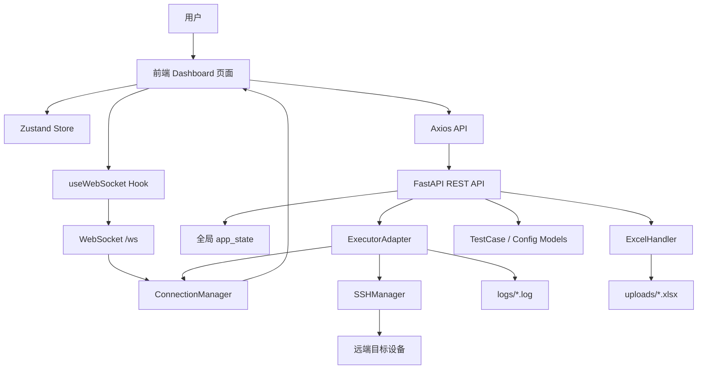
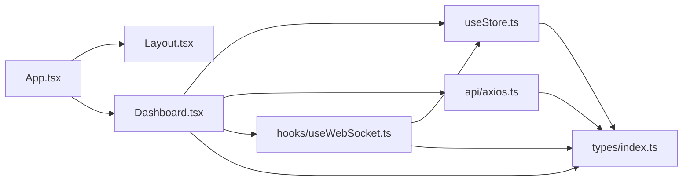
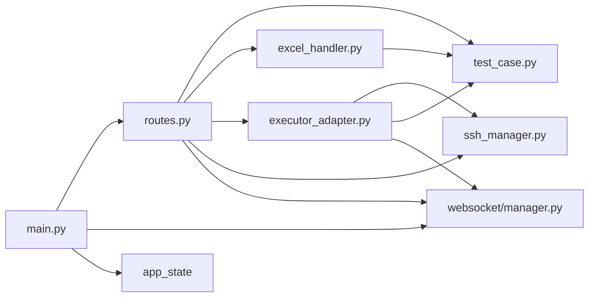
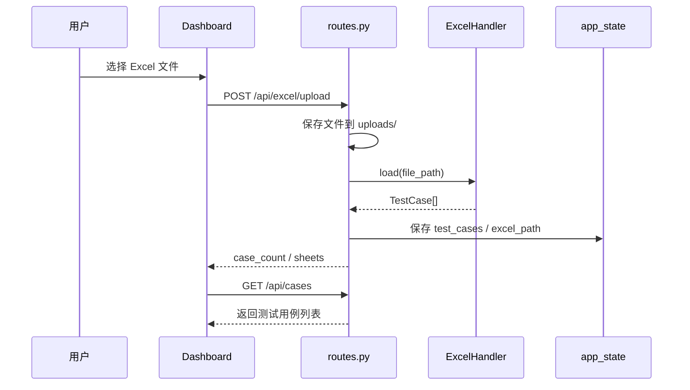
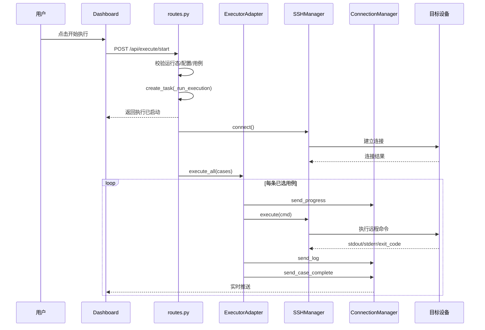
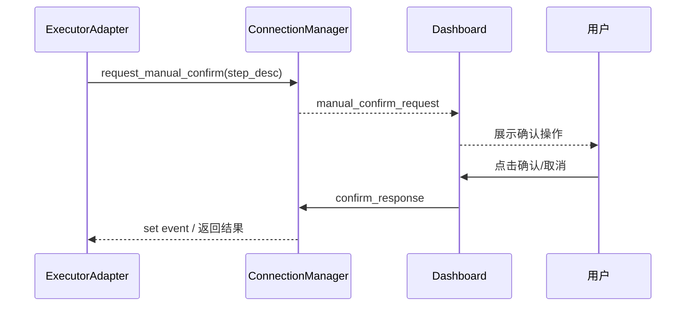
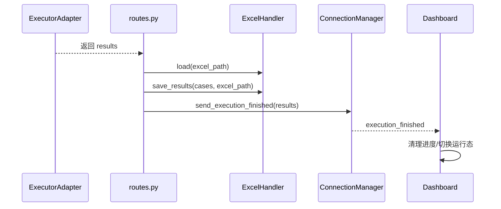

# 测试执行管理系统模块关系图与时序图说明

本文档聚焦于当前工程的模块关系与核心业务时序，便于做设计评审、开发交接和后续重构。

## 0. 文档定位

| 项目 | 内容 |
|---|---|
| 文档名称 | 模块关系图与时序图说明 |
| 适用工程 | `test_runner_web` |
| 文档用途 | 辅助理解模块依赖、通信边界和关键业务流程 |
| 推荐读者 | 架构评审人、开发、测试、维护人员 |

### 0.1 阅读说明

本文件中的图示分为两类：

- **模块关系图**：回答“系统由哪些部分组成、彼此如何依赖”
- **时序图**：回答“关键业务流程在运行时如何协作”

建议与 `docs/ARCHITECTURE.md` 配合阅读：

- 架构文档负责解释“为什么这样设计”
- 图示文档负责表达“这些模块如何协作”

## 1. 模块关系图

### 1.0 图示边界说明

本节图示采用“逻辑组件视图”，重点表达职责与依赖方向，不严格等同于进程级部署图或 C4 完整模型。

阅读时请注意：

- 箭头表示主要调用、依赖或事件流向
- 图中省略了部分通用基础库与框架内部细节
- 图示聚焦主链路，不覆盖所有异常分支

### 1.1 端到端模块关系

### 1.2 前端内部模块关系

### 1.3 后端内部模块关系

## 2. 时序图说明

### 2.0 时序图使用约定

本节时序图中的参与者分为四类：

- **用户侧**：用户、前端 Dashboard
- **接口侧**：FastAPI 路由、WebSocket 管理器
- **业务侧**：执行器、状态容器、ExcelHandler
- **基础设施侧**：SSHManager、目标设备、文件系统

时序图重点表达：

- 谁发起动作
- 谁负责业务编排
- 谁承担实时反馈
- 最终结果如何沉淀

### 2.1 Excel 上传与解析

### 2.2 执行启动与逐条执行

### 2.3 人工确认交互

### 2.4 执行结束与结果回写

## 3. 图示阅读建议

如果用于评审或后续开发，可以按下面顺序阅读：

1. 先看“端到端模块关系图”，理解系统分层
2. 再看“后端内部模块关系”，理解执行链路
3. 再看“Excel 上传”和“执行启动”时序图，掌握主流程
4. 最后看“人工确认”和“结果回写”时序图，理解系统亮点与关键差异化能力

## 4. 图示与架构章节映射

| 图示章节 | 对应架构关注点 |
|---|---|
| 1.1 端到端模块关系 | 总体分层、系统边界 |
| 1.2 前端内部模块关系 | 前端职责划分、状态与通信组织 |
| 1.3 后端内部模块关系 | 后端接入层、编排层、适配层关系 |
| 2.1 上传与解析时序 | Excel 导入链路 |
| 2.2 执行启动与逐条执行 | 主执行链路 |
| 2.3 人工确认交互 | 半自动测试交互机制 |
| 2.4 执行结束与结果回写 | 结果沉淀与闭环 |

## 5. 结论

从模块关系和时序上看，当前系统的架构核心非常明确：

- **REST 负责命令与查询**
- **WebSocket 负责实时反馈**
- **ExcelHandler 负责测试资产读写兼容**
- **ExecutorAdapter 负责执行编排**
- **SSHManager 负责远端执行落地**

这说明该系统的核心价值不在“平台复杂度”，而在“测试资产兼容 + 执行闭环 + 实时交互”。
